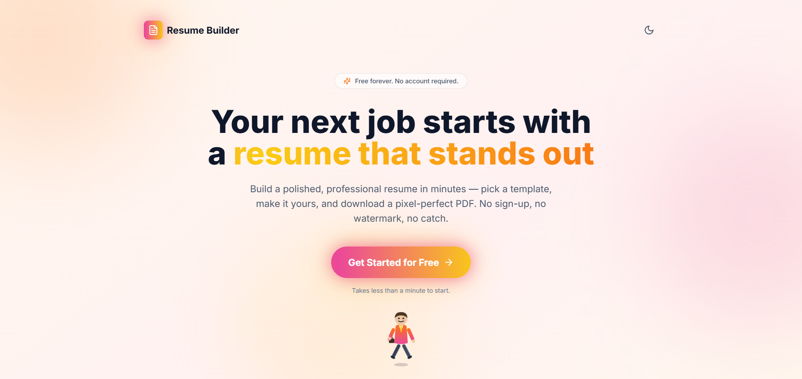
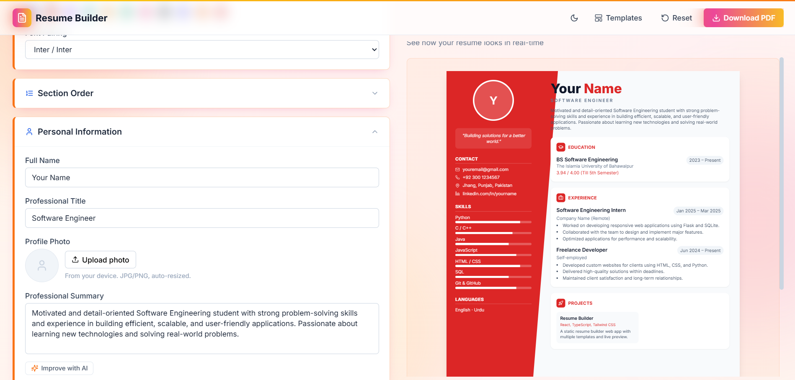
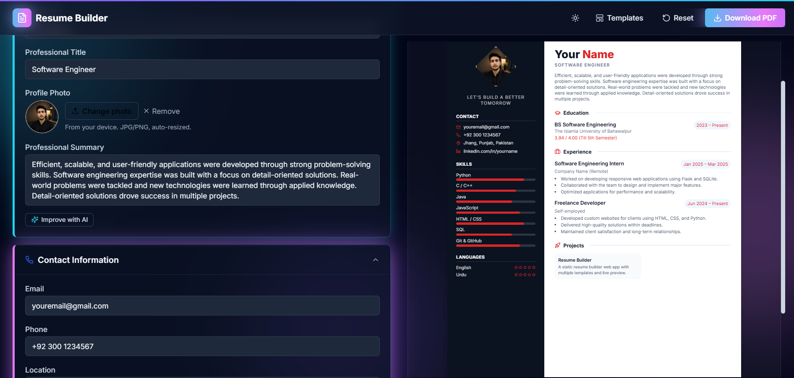
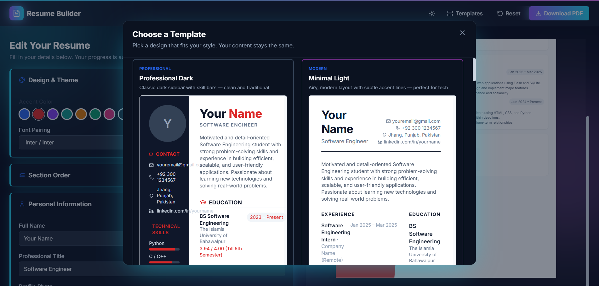

# Resume Builder

A free, no-signup, no-database resume builder that lets anyone create a polished, professional resume in minutes — pick a template, personalize it, and download a PDF. Everything runs entirely in the browser.

> **This README is written as the final project report for my AI Classes final project.**

---

## a. What it does, and the problem it solves

**The problem:** Job seekers — especially students and early-career applicants — need a professional-looking resume, but the common options are all frustrating in one way or another:
- Paid tools (Canva Pro, Resume.io, Novoresume) put good templates behind a subscription or watermark the free tier.
- Word/Google Docs templates are stiff, hard to restyle, and easy to break the layout of.
- Free "resume builder" sites usually require an account, email signup, or hold your data on their servers.

**Who it's for:** Students and job seekers who want a genuinely free, no-friction way to produce a good-looking, exportable resume without creating an account or trusting a third party with their personal data.

**The solution:** Resume Builder is a fully static, client-side web app. You fill in a form, watch a live preview update as you type, pick from 13 distinct templates, personalize the color theme and fonts, reorder sections, and export a PDF — all with **zero backend, zero database, and zero signup**. Nothing you type ever leaves your browser (it's saved to `localStorage` only), which also means there's no privacy concern with uploading personal data like your name, email, and phone number to a stranger's server.

---

## b. Live app

🔗 **Live URL:** [ADD YOUR DEPLOYED VERCEL URL HERE]

🔗 **GitHub repository:** [ADD YOUR PUBLIC GITHUB REPO URL HERE]

> Before submitting: open your repo link in an incognito window to confirm it does **not** ask for login.

---

## c. Features

**Resume content & editing**
- Full editable form: personal info, contact details, technical skills (with proficiency bars), languages, education, experience, projects, certifications, achievements, leadership, tech stack, and extra-curricular activities
- Live, real-time side-by-side preview as you type
- Auto-save to `localStorage` — refresh or close the tab and your progress is still there
- One-click **Reset** to start over

**Templates & design**
- **13 distinct resume templates** (Professional Dark, Minimal Light, Modern Split, Creative Timeline, Bold Header, Elegant Serif, Compact Tech, Geometric Accent, Diamond Navy, Two-Tone Panels, Photo Grid, Executive Ribbon, Gradient Wave), each rendering the same data differently
- **Design & Theme panel**: pick an accent color (10 presets + a custom color picker) and a font pairing (7 heading/body combinations) — applied live across whichever template is active
- **Section reordering**: move Education, Experience, Projects, Certifications, Achievements, Leadership, and Extra-Curricular up/down to control print order
- **Profile photo upload directly from your device** — auto-resized and compressed client-side before being stored, no file ever uploaded anywhere
- Automatic "fit to one page" scaling so the on-screen preview always shows a full A4-proportioned page regardless of how much content you've added
- **Dark / light mode**, each with its own distinct neon color palette (warm "sunset" tones in light mode, cool "cyberpunk" tones in dark mode) — not just an inverted color scheme

**Export & UX**
- One-click **Download PDF** of the finished resume
- **"Improve with AI"** on the Professional Summary and each Experience entry — rewrites your text to be more professional and concise (see section d)
- Fully responsive — usable on mobile, tablet, and desktop
- Branded landing page with an animated, hand-coded (no external assets) walking character mascot, and a short animated loading transition into the app

---

## d. AI feature

**"Improve with AI"** — a button next to the Professional Summary field, and next to each Experience entry's bullet points, that rewrites your text to be more professional and concise while preserving the actual facts you wrote (it's not allowed to invent achievements, employers, or numbers).

- **Where it appears:** Personal Information → Professional Summary, and each entry under Experience.
- **How it works:** the browser sends your current text to a Vercel Serverless Function (`/api/ai-assist`), which calls the **Groq API** (model: `llama-3.3-70b-versatile`) server-side and returns the rewritten text. The API key lives only in Vercel's environment variables — it's never present in the browser or the repository.
- **What it does differently per field:** in "summary" mode it returns a single tightened paragraph; in "bullets" mode it takes your bullet list (one point per line) and returns the same number of lines, each rewritten to start with a strong action verb.

**The exact system prompt used** (from `api/ai-assist.ts`):

```
You are a professional resume-writing assistant helping a job seeker improve their resume text.
Follow these rules exactly:
1. Never invent facts, employers, dates, numbers, or skills that are not implied by the user's original text.
2. Write in a professional, concise, achievement-oriented tone appropriate for a resume.
3. Avoid clichés and filler words such as "hardworking", "team player", or "passionate go-getter".
4. If the mode is "summary": return a single paragraph of 2-4 sentences, with no first-person pronouns.
5. If the mode is "bullets": the input is a list of bullet points, one per line. Return the SAME NUMBER of lines, each rewritten to start with a strong past-tense action verb, stay under 25 words, and contain no leading bullet symbol or numbering.
6. Return ONLY the rewritten text — no headers, no quotes, no explanations, no markdown formatting.
```

**Setup required to run this feature:** set a `GROQ_API_KEY` environment variable (free key from [console.groq.com/keys](https://console.groq.com/keys)) — locally in a `.env.local` file (see `.env.example`), and in your Vercel project's Environment Variables for production. Without it, the rest of the app still works normally; only the "Improve with AI" buttons will show an error.

---

## e. Tools, services, and AI models used to build it

| Category | What was used |
|---|---|
| Framework | React 18 + TypeScript |
| Build tool | Vite |
| Styling | Tailwind CSS (utility classes) + hand-written CSS for animations/theming |
| Icons | [lucide-react](https://lucide.dev) |
| PDF export | [html2canvas](https://html2canvas.hertzen.com/) + [jsPDF](https://github.com/parallax/jsPDF) |
| Persistence | Browser `localStorage` (no backend/database) |
| AI provider | [Groq API](https://groq.com) (`llama-3.3-70b-versatile`), called from a Vercel Serverless Function |
| Hosting / deployment | [Vercel](https://vercel.com) |
| Version control | Git + GitHub |
| **AI coding assistant** | **Claude (Anthropic)** — used throughout as a pair-programming assistant: scaffolding the project, building all 13 templates, the theming/dark-mode system, the page-fit and PDF export logic, the landing page and animated mascot, and debugging issues found during testing. Every feature, fix, and design decision was directed and reviewed by me; Claude wrote code to my specification and iterated based on my feedback and screenshots of bugs I found. |

---

## f. Screenshots

> Add at least 3 screenshots below. Take them from your **live deployed app**, save them into a `/screenshots` folder in this repo, and update the paths below to match.


*Landing page with the animated mascot and neon branding.*


*The editing form and live preview, light mode.*


*The editing form and live preview, dark mode.*


*Choosing between the 13 available templates.*

---

## g. How to run this project locally

**Requirements:** Node.js 18+, npm, and a free [Groq API key](https://console.groq.com/keys) if you want the "Improve with AI" buttons to work.

```bash
git clone <your-repo-url>
cd resume-builder
npm install
cp .env.example .env.local   # then paste your GROQ_API_KEY into .env.local
npm run dev
```

Open the local URL Vite prints (defaults to `http://localhost:3000`).

> Note: `npm run dev` runs the Vite dev server only, which serves the app but **not** the `/api/ai-assist` serverless function. To test the AI feature locally, install the Vercel CLI (`npm i -g vercel`) and run `vercel dev` instead — everything else in the app works fully under plain `npm run dev`.

**To build for production:**
```bash
npm run build
npm run preview   # optional: preview the production build locally
```

**To deploy your own copy to Vercel:**
1. Push this repo to your own GitHub account.
2. Go to [vercel.com](https://vercel.com) → **Add New Project** → import the repo.
3. Framework preset: **Vite**. Build command: `npm run build`. Output directory: `dist`.
4. In **Project Settings → Environment Variables**, add `GROQ_API_KEY` with your key.
5. Deploy.

---

## Project structure

```
resume-builder/
├── index.html
├── package.json
├── vite.config.ts
├── tailwind.config.ts
├── vercel.json
├── .env.example                    # documents GROQ_API_KEY (never commit the real key)
├── api/
│   └── ai-assist.ts                # Vercel Serverless Function — calls the Groq API server-side
├── src/
│   ├── main.tsx
│   ├── App.tsx                     # landing → loading → builder flow
│   ├── index.css                   # theming, neon system, animations, print CSS
│   ├── types/
│   │   ├── resume.ts                # ResumeData shape, theme & section-order config
│   │   └── templates.ts             # metadata for all 13 templates
│   ├── lib/
│   │   ├── sections.ts               # computes section render order
│   │   ├── image.ts                  # client-side photo resize/compression
│   │   ├── pageFit.ts                # auto-fit-to-one-page scaling logic
│   │   └── aiAssist.ts               # frontend helper that calls /api/ai-assist
│   ├── hooks/
│   │   └── useResume.ts              # state + localStorage persistence
│   ├── components/
│   │   ├── WalkingCharacter.tsx      # coded SVG mascot
│   │   └── resume/
│   │       ├── ResumeForm.tsx        # includes the "Improve with AI" buttons
│   │       ├── ResumePreview.tsx
│   │       ├── TemplatePickerModal.tsx
│   │       └── templates/            # all 13 template components
│   └── pages/
│       ├── landing/
│       │   ├── page.tsx
│       │   └── LoadingTransition.tsx
│       └── home/
│           └── page.tsx              # main builder UI
```

## Notes on data & privacy

This app has no backend and no database — all resume data lives only in your browser's `localStorage`, under the key `resume-builder:data`, and is never transmitted anywhere **by default**.

The one exception is the **"Improve with AI" feature**: when you click it, the specific text in that field (your summary, or one entry's bullet points — not your whole resume) is sent to the `/api/ai-assist` serverless function and forwarded to the Groq API to generate the rewritten version. If you never click "Improve with AI," nothing leaves your browser at all.